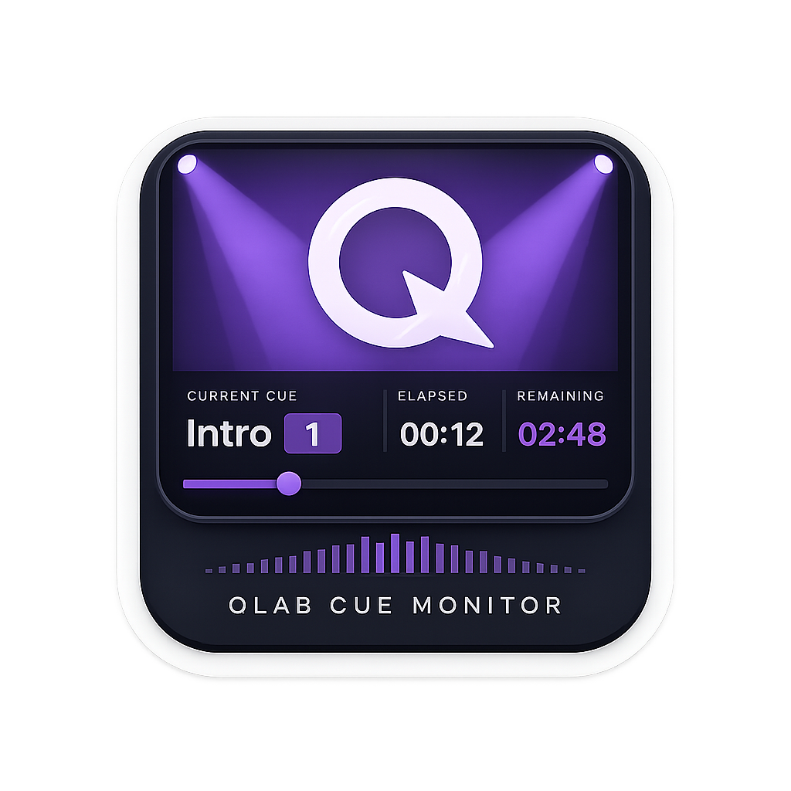
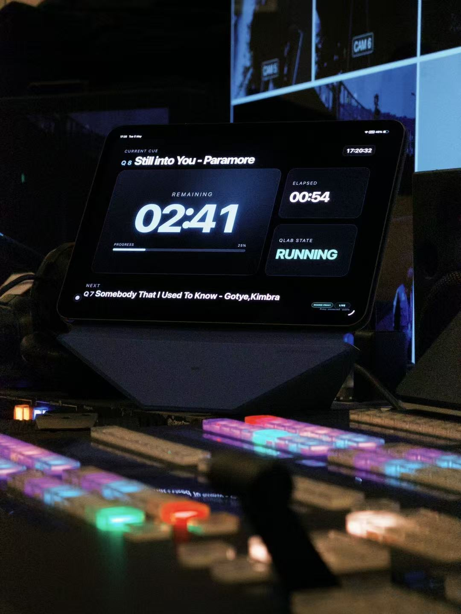
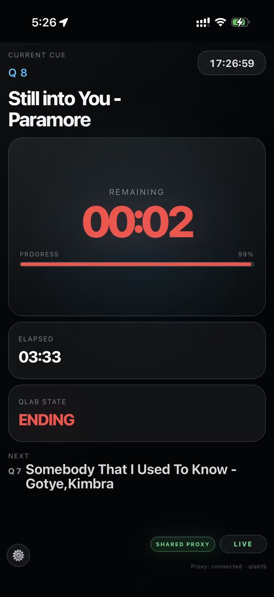
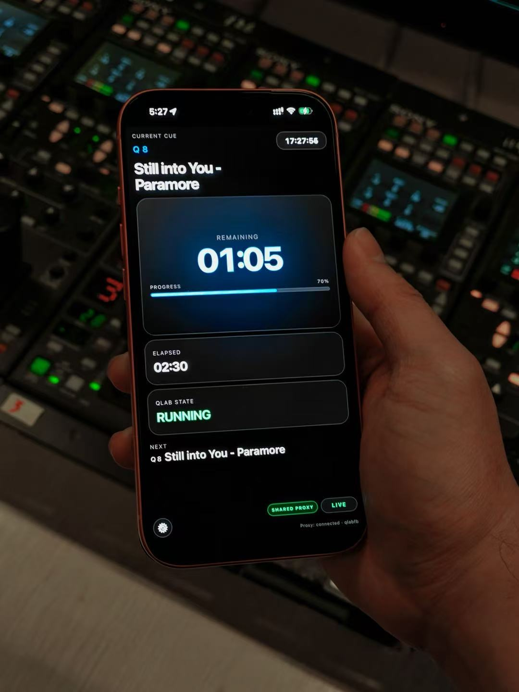
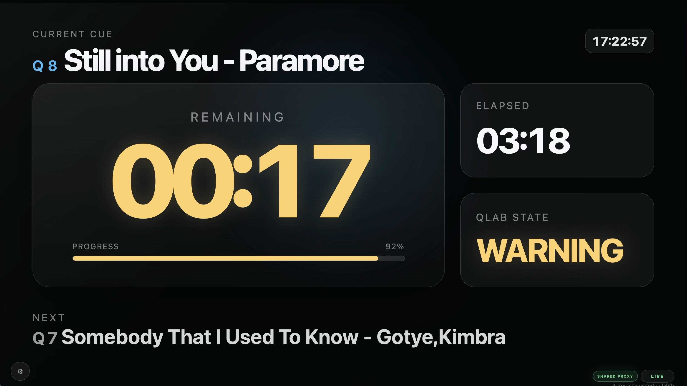

# QLab Cue Monitor

<p align="center">
  
</p>

QLab Cue Monitor is a local cue dashboard for live shows.

- The menu-bar app starts and stops the local proxy service
- The local service polls Companion and caches state
- Other devices on the same network only read the dashboard page

## Highlights

- Real-time cue name, cue number, remaining time, elapsed time, and next cue
- Shared dashboard mode for multiple devices
- Mobile, tablet, and desktop responsive layout
- Bundled Node runtime for easier distribution

## Showcase

<table>
  <tr>
    <td></td>
    <td></td>
  </tr>
  <tr>
    <td></td>
    <td></td>
  </tr>
</table>

<p align="center">
  
</p>

## Quick Start

### For the dashboard server

Open the bundled app:

- `QLab Cue Monitor v4.app`

Or run the shell launcher:

```bash
./start.command
```

Then open:

```text
http://127.0.0.1:8080/index.html
```

### To stop the server

```bash
./stop.command
```

## Build

### Build the app bundle

```bash
./build-app.sh
```

### Build the DMG

```bash
./build-dmg.sh
```

## Repository Layout

- `index.html` - dashboard UI
- `server.js` - local proxy service
- `mac-app/` - Swift source for the menu-bar app
- `assets/` - icon source files
- `start.command` / `stop.command` - manual launch scripts
- `release/` - packaged release artifacts

## Third-party dependencies

This project depends on Bitfocus Companion as an external runtime data source.

- This repository does not include Companion source code
- The project communicates with Companion over HTTP at runtime
- Companion is a separate third-party product and is not licensed by this repository
- Any use of Companion remains subject to Companion's own license, terms, and configuration

## License

This repository is licensed under [PolyForm Noncommercial 1.0.0](./LICENSE).

- Non-commercial use, modification, and redistribution are allowed
- Commercial resale or monetization of this project is not allowed
- If you need commercial rights, contact the author for a separate license
